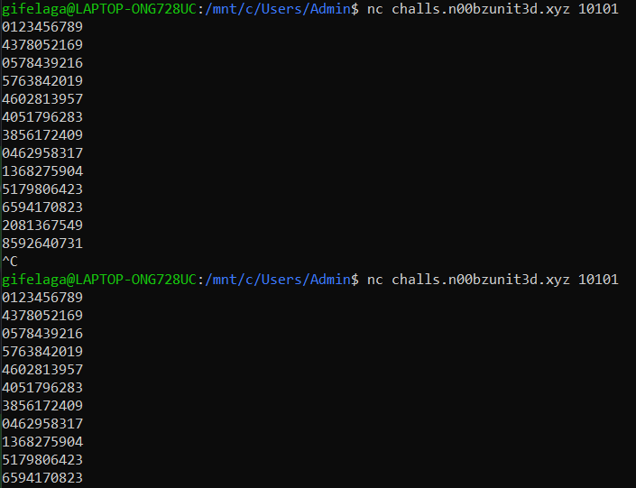

# Introduction

Author: [Gifelaga](https://github.com/Gifelaga)\
Name: crypto/Random\
Solves/Points: 177 solves / 451 points
> Description: I hid my password behind an impressive sorting machine. The machine is very luck based, or is it?!?!?!?

This is the challenge source code:

```cpp
#include<chrono>
#include<cstdlib>
#include<iostream>
#include<algorithm>
#include<string>
#include<fstream>
#include<thread>
#include<map>
using namespace std;

bool amazingcustomsortingalgorithm(string s) {
    int n = s.size();
    for (int i = 0; i < 69; i++) {
        cout << s << endl;
        bool good = true;
        for (int i = 0; i < n - 1; i++)
            good &= s[i] <= s[i + 1];
        
        if (good)
            return true;

        random_shuffle(s.begin(), s.end());

        this_thread::sleep_for(chrono::milliseconds(500));
    }

    return false;
}

int main() {
    string s;
    getline(cin, s);

    map<char, int> counts;
    for (char c : s) {
        if (counts[c]) {
            cout << "no repeating letters allowed passed this machine" << endl;
            return 1;
        }
        counts[c]++;
    }

    if (s.size() < 10) {
        cout << "this machine will only process worthy strings" << endl;
        return 1;
    }

    if (s.size() == 69) {
        cout << "a very worthy string" << endl;
        cout << "i'll give you a clue'" << endl;
        cout << "just because something says it's random mean it actually is" << endl;
        return 69;
    }

    random_shuffle(s.begin(), s.end());
    
    if (amazingcustomsortingalgorithm(s)) {
        ifstream fin("flag.txt");
        string flag;
        fin >> flag;
        cout << flag << endl;
    }
    else {
        cout << "UNWORTHY USER DETECTED" << endl;
    }
}
```

# Description

The challenge provides a really simple sorting algorithm called `amazingcustomsortingalgorithm(s)`: a [bogosort](https://en.wikipedia.org/wiki/Bogosort)!\
For those new to the wonderful art of ✨**sorting**✨, a `bogosort` is basically an algorithm in which the values of an array (in this case a string) are randomly shuffled until they *somehow* appear in order.

So, the aim in this challenge is to provide a string of at least 10 characters without repetitions that will result in a sorted (ascending ascii values) string with a maximum of 70 random shuffles.

# Vulnerability

But how is this possible?\
Bogosort is famous to not be really efficient when we talk about sorting: it has an average complexity of $O(n \times n!)$ which is really not the best when you have a possibility of $O(n \times 70) = O(n)$.

Let's reanalyze the problem in mathematical terms:

In each shuffle, there are $n!$ possible permutations of the string, where $n$ is the length of the string.\
How many favorable outcomes do we have? Which is the number of permutations that result in a sorted string. Since the string is composed of unique characters there is only one permutation which is ordered \
So the number of favorable outcomes is $1$.

And since we have a maximum of $70$ random shuffles to get that string, the probability of getting a sorted string of lenght $n$ in exactly $70$ shuffles is $\frac{70}{n!}$.

How can we minimise it? Putting $n=10$ which is the minimum, in this case the probability would be $\frac{70}{10!} \cdot 100 \% \approx 0.0019\% $

To get a $50\%$ probability of getting a sorted string in $70$ shuffles, we would need $0.5 = \frac{70}{n!} \Rightarrow n! = 140 \Rightarrow n \approx 5$ which is not possible.

However, if we assume $n$ to be $10$ then we can calculate how many inputs we would need to get a $50\%$ probability of getting the flag.\
We can caculate this by taking the probability of not getting the flag in $70$ shuffles and calculating after how many reruns it would be less than $0.5$. Which is $(1 - \frac{70}{10!})^x < 0.5$ where $x$ is the number of reruns.\
This is easily solved through a logarithm: $x > \frac{\log(0.5)}{\log(1 - \frac{70}{10!})} \approx 35932$. In terms of time, given the timeout in the sort function, this would take $35932 \times 70 \times 0.5 = 1257620$ seconds which is approximately $14.5$ days.

So... we won't get the flag?\
Well, if the bogosort algorithm was really random, we would not ever got the flag.

Although, we're going to transform this **ENORMOUS** time complexity to the best case which is $O(n)$ (an array sorted at the first shuffle), how?

Is this algorithm really random?\
Or to be more precise, is `random_shuffle(s.begin(), s.end())` really random?

Too much math here, let's just look in the code and try to run this program...\
Firstly we find online things like [this](https://stackoverflow.com/questions/22600100/why-are-stdshuffle-methods-being-deprecated-in-c14#:~:text=random_shuffle%20is%20being%20deprecated%20because,which%20is%20implemented%20really%20poorly!) or [this](https://github.com/matplotlib/matplotlib/issues/24010/)\
Basically it seems that there's no seed in here, so the random shuffle is not really random.
Let's send a string of 10 characters (casually "0123456789").



What?? The sortings are the same!\
So we just need to map the characters of the first sorted string and then _reverse_ the mapping to get the flag.

# Exploit

Here a working exploit:

```python
from pwn import *

c = remote('challs.n00bzunit3d.xyz', 10377)

superdict = {}

req0 = '0123456789'
c.sendline(req0.encode())
res0 = c.recvline().decode()

for i in range(10):
    superdict[res0[i]] = req0[i]

c.close()

c = remote('challs.n00bzunit3d.xyz', 10377)

req1 = ''
for i in range(10):
    req1 += superdict[str(i)]

c.sendline(req1.encode())
res1 = c.recvline().decode()

flag = c.recvline().decode().strip()
print(flag) # n00bz{5up3r_dup3r_ultr4_54f3_p455w0rd_98921e98c527}
```
