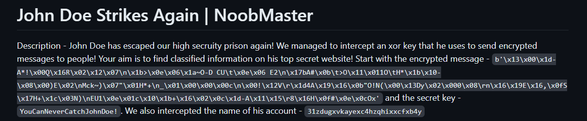

# OSINT for n00bzCTF2024

## The Gang 1
### Description
John Doe has been suspected of creating a gang. The members of team n00bzUnit3d also seem associated with it. Can you find out if John Doe has recently joined the team? You might find what you are looking for ;) P.S.: The team website might help
### Write-up
As mentioned in the description, visit the website [here](https://n00bzUnit3d.xyz) and head to the members section. There, you'll find John Doe listed among the team! The flag is included in the quote! 
#### *Flag --> n00bz{1ts_051N7_71m3_3e4a7d6f}*
## The Gang 2
### Description
You may have gotten your first flag, but it's just the beginning! John Doe, as overconfident as he is, has left you with a riddle. Maybe it hides some secrets? Continue where you left off last time.
### Write-up
Previously, you found the flag in John Doe's bio. Now, there's an article written by John Doe that contains a riddle. If you take the first letter of each sentence in the riddle, it spells out **USERNAMEISJOHNHACKERDOE**, suggesting that the username is *johnhackerdoe*. A bit of searching will reveal that this user is on Twitter. The person’s name is John Hacker Doe, which confirms they are the right individual. There’s just one post, and it has the flag! 
#### *Flag --> n00bz{5t0p_ch4s1ng_m3_4f2d1a7d}*
## The Gang 3
### Description 
Can you find out where the OG meetup point is? The flag is in the format n00bz{lat,long} with upto 3 decimal places, rounded. Note: Wikipedia can be wrong sometimes ;)
### Write-up
In OSINT 2, a Twitter post by John Doe reveals a challenge for you. Additionally, in a more recent post, he mentions someone named Eth007 who criticized the organization of CTF competitions organized by him.  
The most important piece of information from the post is that John Doe met with someone in a specific city in 2022, the coordinates of which need to be found. Furthermore, John Doe claims that the key "is the same as last time."
This suggests links to previous CTF solutions related to John Doe.  Therefore, all that needs to be done is to search for these two pieces of information in previous CTF solutions. 
> [!NOTE] 
> This is crucial for reconstructing John Doe's story!!!

Decrypting the ciphertext (a simple AES-GCM encryption) reveals a Discord invite. After joining the server, you'll find discussions among three people planning to meet near a statue at Terminal 2 airport in Bengaluru. They mention details like "The statue is 110 feet tall" and "The airport is named after the person depicted in the statue." This leads to the Kempe Gowda International Airport and the statue of Kempe Gowda. Google searching and Google Maps will help you find the coordinates! 
#### *Flag --> n00bz{13.199,77.682}*
## The Gang 4
### Description
### Write-up
Continuing to read the conversation on the Discord server, it's possible to gather information about the flight John Doe will take. Consequently, you need to search the web for the specific flight and obtain the flag!!!
#### *Flag --> n00bz{03/08/2024_AI506_DEL_BLR_10:03_12:44_30_AirbusA350-900}*
